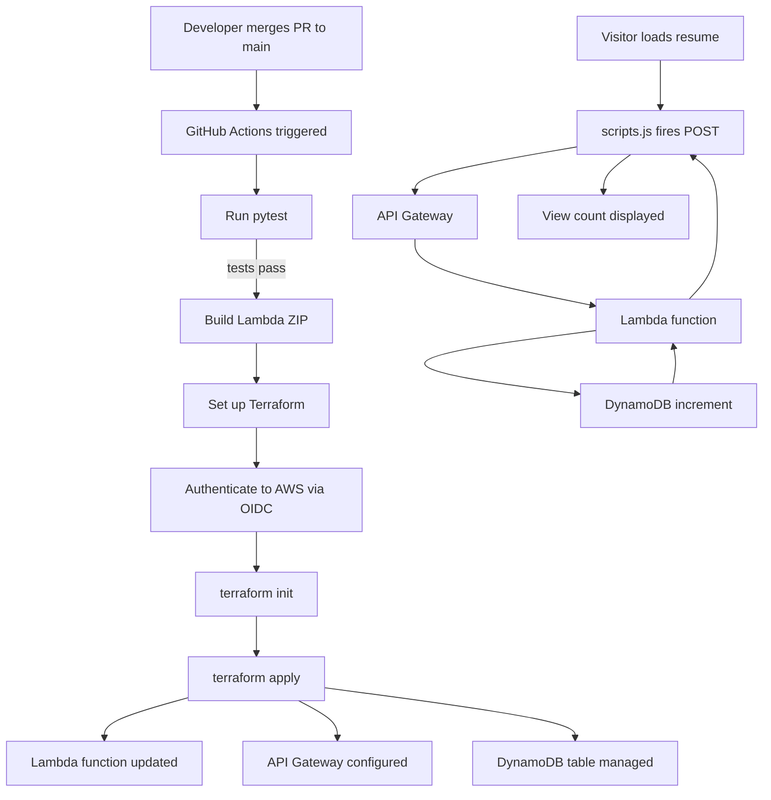

# mirellabatista-com-backend

Serverless visitor counter backend for [mirellabatista.com](https://www.mirella-batista.com) —
built and deployed on AWS as part of the [Cloud Resume Challenge](https://cloudresumechallenge.dev)
(AWS 2026 version).

## About This Project

This backend is the result of completing the [Cloud Resume Challenge](https://cloudresumechallenge.dev)
(AWS 2026 version) — a hands-on project designed to build and demonstrate real cloud engineering
skills.

The challenge was completed with the assistance of Claude and Claude Code as AI pair programming
tools. Rather than copying solutions, the approach throughout was deliberate and methodical:
concepts were explained before execution, every step was verified with terminal output or
screenshots, and nothing was assumed complete until confirmed working. Claude Code was used for
file creation and terminal commands; Claude (claude.ai) was used for architecture decisions,
concept explanations, and document generation.

This reflects how I believe AI tools should be used in engineering: as a thinking partner that
accelerates learning and execution, not a replacement for understanding.

## Tech Stack

- Python 3.13 (Lambda runtime)
- AWS Lambda (serverless compute)
- AWS API Gateway (HTTP API)
- AWS DynamoDB (visitor counter storage)
- Terraform (infrastructure as code)
- GitHub Actions (CI/CD)
- pytest + moto (unit testing with AWS mocking)
- uv (Python package management)

## Architecture

### Runtime Flow

When a visitor loads the resume, the frontend fires a POST request to the API Gateway endpoint.
API Gateway invokes the Lambda function, which increments the visitor count in DynamoDB and
returns the updated count. The browser displays the count on the page.

### CI/CD Flow

All changes to `main` go through a pull request. Branch protection is enforced on `main` —
no direct pushes are allowed. Every merge triggers the GitHub Actions pipeline.



### Infrastructure

All AWS infrastructure is managed by Terraform. Terraform state is stored remotely in S3
(`terraform-state-mirellabatista-com`) with native S3 locking — no separate DynamoDB lock
table required.

Authentication between GitHub Actions and AWS uses OIDC (OpenID Connect) — no long-lived
credentials are stored anywhere. GitHub presents a signed token to AWS, which verifies it
against the registered identity provider and the trust policy scoped to this specific repo
and branch.

## CI/CD Pipeline

Every merge to `main` that touches `lambda/` or `terraform/` triggers a GitHub Actions
workflow that:

1. Runs pytest unit tests (with moto mocking AWS calls)
2. Builds the Lambda deployment ZIP
3. Installs Terraform 1.14.8
4. Authenticates to AWS via OIDC
5. Runs terraform init (connects to S3 remote state)
6. Runs terraform apply (deploys any infrastructure changes)

If tests fail, the pipeline stops and nothing is deployed.

## Local Development

### Prerequisites

- Python 3.11+
- uv
- Terraform 1.14.8
- AWS CLI with SSO profile configured

### Run Tests

```bash
uv sync
uv run pytest
```

### Terraform

```bash
cd terraform
terraform init
terraform plan
terraform apply
```

## What I Learned

*A full write-up is coming in a blog post. Topics will include: infrastructure as code with
Terraform, serverless architecture, OIDC authentication, CI/CD pipeline design, and unit
testing AWS services with moto.*

## Related

- [Frontend repo](https://github.com/mirella4real/mirellabatista-com-frontend) — static resume
site (S3 + CloudFront + GitHub Actions)
